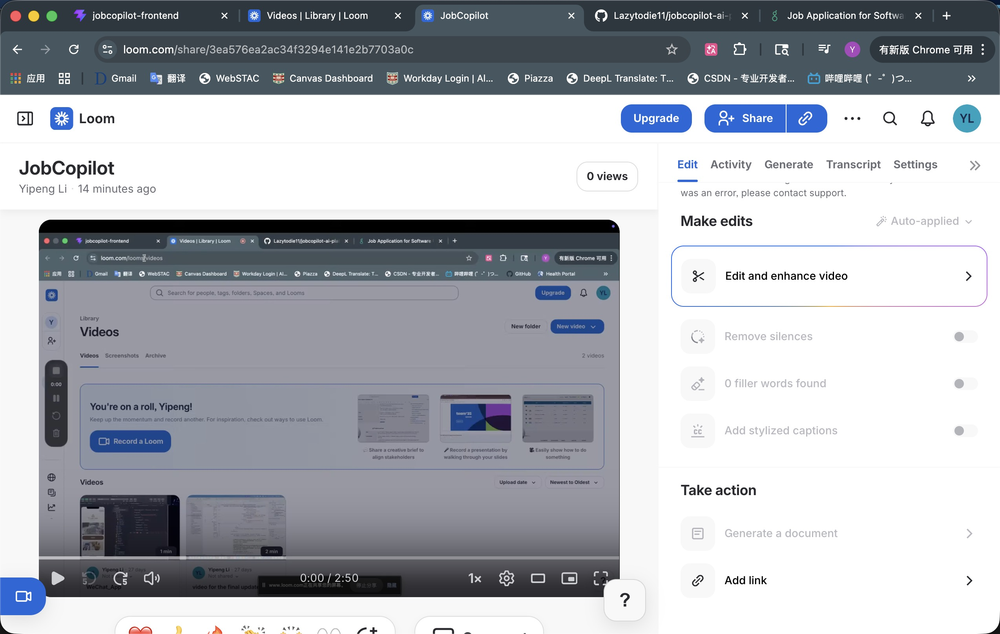
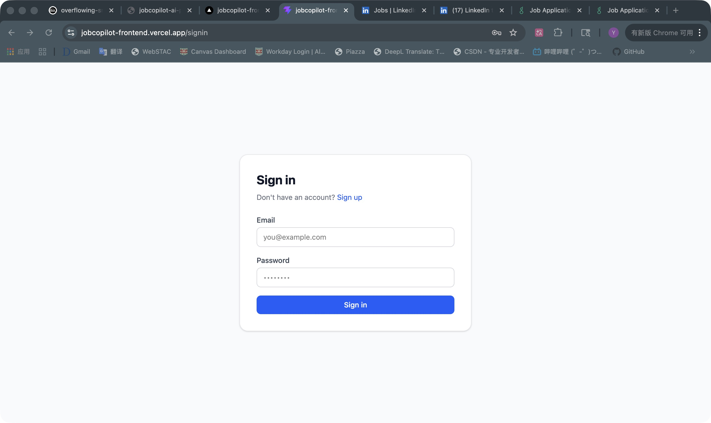
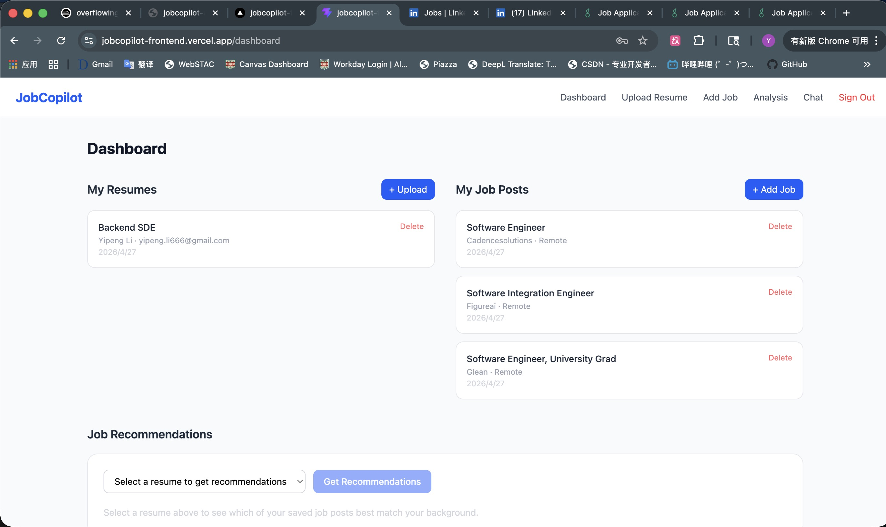
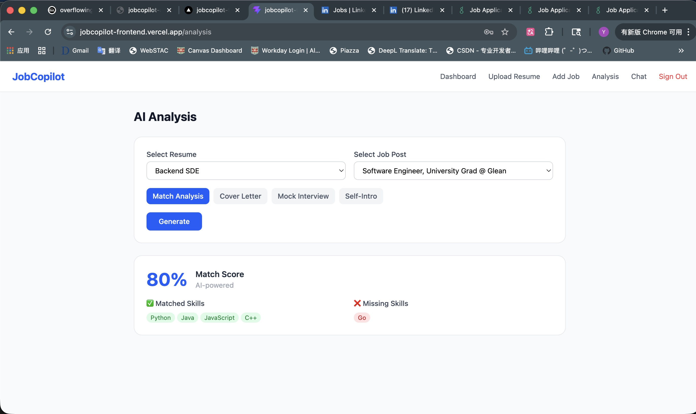
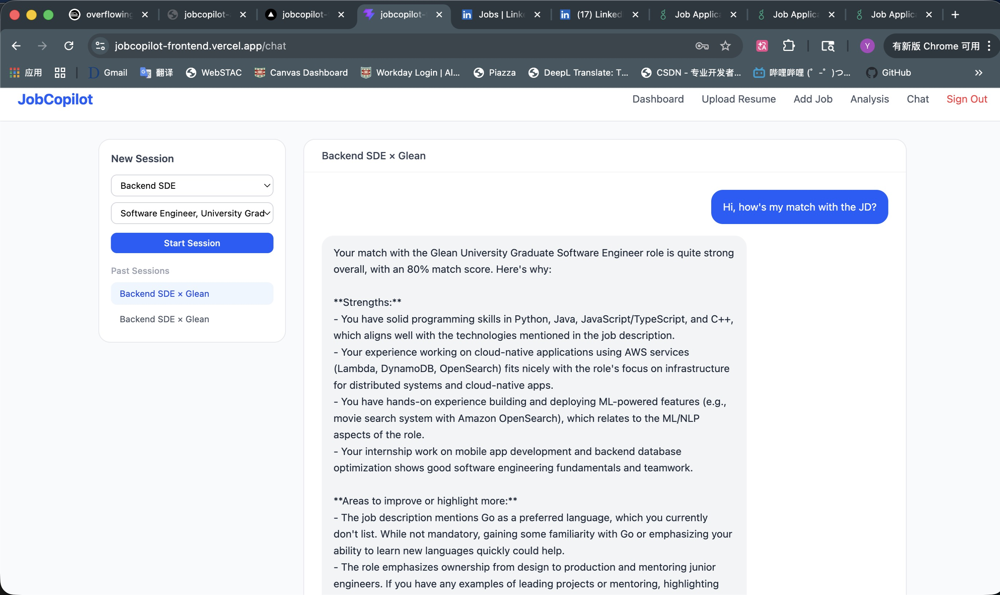
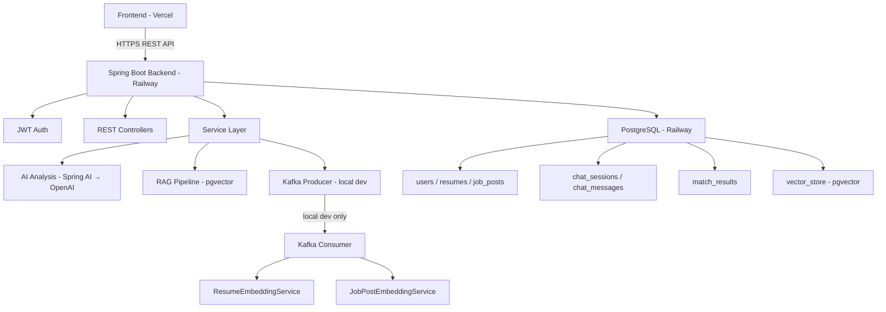
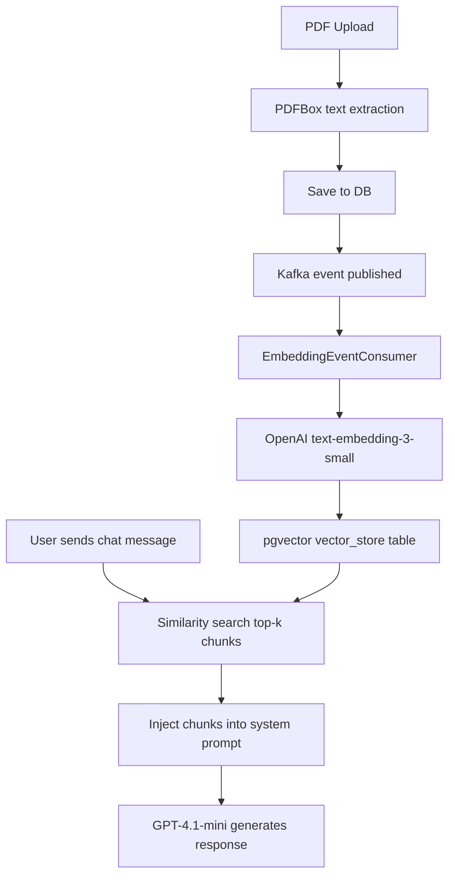

# JobCopilot — AI-Powered Job Application Assistant

JobCopilot is a full-stack AI platform that helps job seekers manage resumes and job descriptions, analyze job fit, and generate tailored application materials through RAG-based and LLM-powered workflows.

- **Frontend**: https://jobcopilot-frontend.vercel.app
- **Backend**: https://jobcopilot-ai-platform-production.up.railway.app
- **Frontend Repo**: https://github.com/Lazytodie11/jobcopilot-frontend
- **Backend Repo**: https://github.com/Lazytodie11/jobcopilot-ai-platform

---

## Repository Scope

This repository contains the **Spring Boot backend** for JobCopilot.
The frontend is maintained separately at:
https://github.com/Lazytodie11/jobcopilot-frontend

The backend provides authentication, resume and job post management, AI analysis workflows, RAG-based multi-turn chat, semantic retrieval with pgvector, and Kafka-based async embedding in local development.

---

## Demo

[](https://www.loom.com/share/3ea576ea2ac34f3294e141e2b7703a0c)

▶ [Watch full demo on Loom](https://www.loom.com/share/3ea576ea2ac34f3294e141e2b7703a0c) — 2 min 50 sec walkthrough covering sign up, resume upload, job post management, match analysis, cover letter generation, and RAG chat.

## Screenshots

### Login


### Resume and Job Post Management


### Match Analysis


### RAG Chat


## Features

- **Resume Management** — Upload PDF resumes with automatic text extraction and vector embedding
- **Job Post Management** — Add job descriptions manually or parse directly from URLs
- **AI Match Analysis** — Score resume-to-JD fit with matched/missing skill breakdown
- **Cover Letter Generation** — RAG-powered, tailored to specific job descriptions
- **Mock Interview Questions** — Role-specific questions with answer hints based on your background
- **Self-Introduction Drafting** — Three versions (30s / 1min / 2min) tailored to each JD
- **JD Recommendation Ranking** — Semantic similarity search across saved job posts
- **Multi-turn RAG Chat** — Context-aware Q&A grounded in resume content via pgvector retrieval
- **Async Embedding Pipeline** — Kafka-based async embedding decouples upload from vector indexing

## Tech Stack

### Backend

| Layer | Technology |
|-------|------------|
| Framework | Java 21 / Spring Boot 3.5.13 |
| AI / LLM | Spring AI 1.1.0 · GPT-4.1-mini · text-embedding-3-small |
| Vector Store | PostgreSQL + pgvector |
| Message Queue | Apache Kafka 3.9.2 |
| Auth | Spring Security + JWT (jjwt 0.12.5) |
| PDF Parsing | Apache PDFBox 3.0.3 |
| URL Parsing | Jsoup 1.18.3 |
| Build | Maven |

### Frontend

| Layer | Technology |
|-------|------------|
| Framework | React 18 + Vite |
| Styling | Tailwind CSS v4 |
| Routing | React Router v6 |
| HTTP | Axios |

### Infrastructure

| Service | Platform |
|---------|----------|
| Backend | Railway |
| Frontend | Vercel |
| Database | Railway PostgreSQL |
| Containers | Docker |

## Architecture



## RAG Pipeline



## API Endpoints
Below are representative endpoints for the main workflows.

### Auth

| Method | Endpoint | Description |
|--------|----------|-------------|
| POST | `/api/users` | Register |
| POST | `/api/users/login` | Login |
| GET | `/api/users/me` | Current user |

### Resumes

| Method | Endpoint | Description |
|--------|----------|-------------|
| POST | `/api/resumes/me/upload` | Upload PDF (auto-embeds via Kafka) |
| POST | `/api/resumes/me/{id}/embed` | Re-embed existing resume |
| GET | `/api/resumes/me` | List my resumes |
| PUT | `/api/resumes/me/{id}` | Update resume |
| DELETE | `/api/resumes/me/{id}` | Delete resume |

### Job Posts

| Method | Endpoint | Description |
|--------|----------|-------------|
| POST | `/api/job-posts/me` | Create (auto-embeds) |
| POST | `/api/job-posts/me/parse-url` | Parse from URL |
| POST | `/api/job-posts/me/{id}/embed` | Re-embed existing JD |
| GET | `/api/job-posts/me` | List my job posts |
| GET | `/api/job-posts/me/recommended` | JD recommendations by resume similarity |
| DELETE | `/api/job-posts/me/{id}` | Delete job post |

### AI Analysis

| Method | Endpoint | Description |
|--------|----------|-------------|
| POST | `/api/analysis/match` | Resume-JD match score + skill gap |
| POST | `/api/analysis/suggestions` | Resume improvement suggestions |
| POST | `/api/analysis/cover-letter` | Generate tailored cover letter |
| POST | `/api/analysis/mock-interview` | Generate interview questions |
| POST | `/api/analysis/self-intro` | Generate self-introduction (3 lengths) |
| GET | `/api/analysis/results/me` | History of match analyses |

### Chat (RAG)

| Method | Endpoint | Description |
|--------|----------|-------------|
| POST | `/api/chat/sessions` | Create session (resume + JD) |
| GET | `/api/chat/sessions/me` | List my sessions |
| GET | `/api/chat/sessions/{id}` | Get session with message history |
| POST | `/api/chat/sessions/{id}/messages` | Send message → AI response |

## Local Development Setup

### Prerequisites

- Java 21
- Maven
- Docker Desktop (for Kafka + Zookeeper)
- PostgreSQL with pgvector extension
- OpenAI API Key

### 1. Clone the repo

```bash
git clone https://github.com/Lazytodie11/jobcopilot-ai-platform.git
cd jobcopilot-ai-platform
```

### 2. Configure environment

Copy the example config and fill in your values:

```bash
cp src/main/resources/application.properties.example src/main/resources/application.properties
```

Required environment variables:

| Variable | Description |
|----------|-------------|
| `DB_USERNAME` | PostgreSQL username |
| `DB_PASSWORD` | PostgreSQL password |
| `DATABASE_URL` | Full JDBC URL e.g. `jdbc:postgresql://localhost:5432/jobcopilot` |
| `OPENAI_API_KEY` | OpenAI API key |
| `JWT_SECRET` | Secret key for JWT signing (min 32 chars) |
| `SPRING_PROFILES_ACTIVE` | Set to `prod` for production, omit for local |
| `KAFKA_URL` | Kafka bootstrap server, e.g. `localhost:9092` |

### 3. Enable pgvector

In your local PostgreSQL:

```sql
CREATE EXTENSION IF NOT EXISTS vector;
```

### 4. Start Kafka

```bash
docker-compose up -d
```

> Note: > This repository includes the Dockerfile for the Spring Boot backend. The included `docker-compose.yml` is only used to start Kafka and Zookeeper for local async embedding workflows. The backend and database are configured separately.

### 5. Run the backend

```bash
./mvnw spring-boot:run
```

Backend runs on `http://localhost:8080`

### 6. Run the frontend

The frontend is maintained in a separate repository:
https://github.com/Lazytodie11/jobcopilot-frontend

If you cloned both repos side by side locally:

```bash
cd ../jobcopilot-frontend
npm install
npm run dev
```

Frontend runs on `http://localhost:5173`

## Deployment

| Service | Platform | Notes |
|---------|----------|-------|
| Backend | Railway | Auto-deploys from GitHub main branch |
| Frontend | Vercel | Auto-deploys from GitHub main branch |
| Database | Railway PostgreSQL | pgvector extension enabled |

> Production uses sync embedding (Kafka disabled via Spring `prod` profile).
> Local development uses Kafka for async embedding via `docker-compose.yml`.

